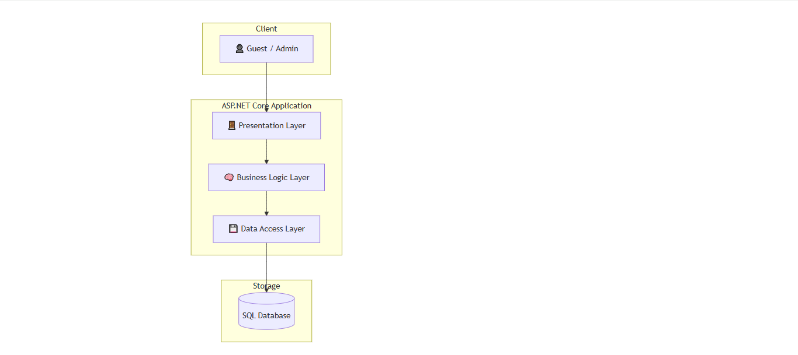
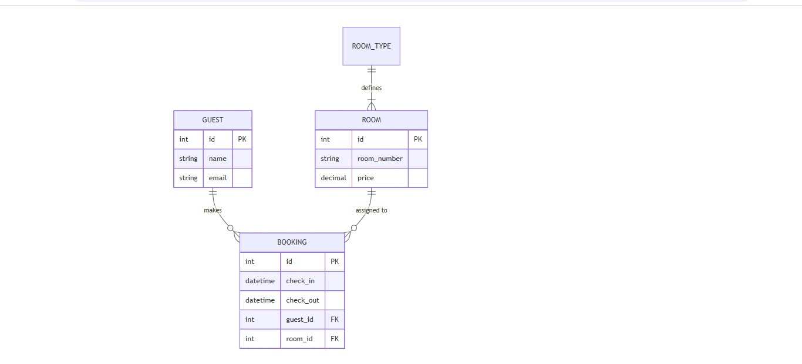
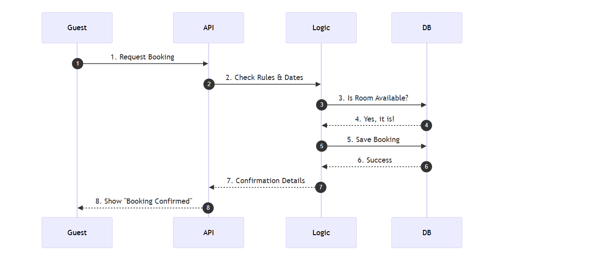

1. Overview
This is a computer program that helps people book hotel rooms. It uses C# and .NET 9.0.

2. Technology Stack
Language: C# (The code)

Framework: .NET 9.0 (The engine)

Database: SQL Server (The memory)

## 3. System Map
This is how the different parts of the program talk to each other.

## 4. Database Schema (ERD)
This diagram shows how our data is organized and how the tables link together.

4. Layer Responsibilities
To keep things tidy, we split the work into three boxes:

The API (Front Door): Greets the user and takes their request.

The Logic (Brain): Figures out if the request is allowed.

The Database (Memory): Saves the information forever.

## 5. How a Booking Happens
This is the story of what happens when someone clicks "Book Now."

6. Decisions
Why .NET 9? Because it is the newest and fastest version.

Why Layers? So the code stays organized, like putting your socks in one drawer and your shirts in another.

